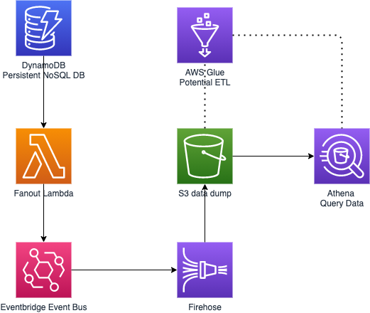

{}
Very rough initial design for an analytics piece of yurtyme which would plug into the previously described backend.
{}

We could have a read replica on our Dynamo Table which we stream fanout to and our eventbus. From here we could use Kinesis firehose to stream the data dump into S3. Athena could be used to run queries directly against S3 or we could first of all crawl the data using Glue and transform it into a more queryable data model.
