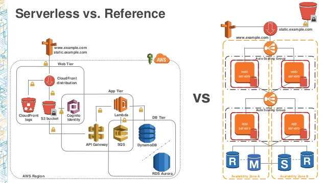

So lets ignore the reporting API for the moment and concentrate on the core part of the system. Using the AWS services available today what could our solution now look like?

To begin with, for an MVP, we could aim to go for a serverless solution. I'll step into the details of front-end vs back-end in the subsequent sections and go into more detail on what each one does.

### Front End

We could host our PWA as a static site in S3 and enforce SSL via a Cloudfront distribution. This would be a minimal cost upfront but would easily scale as our user base grew. It can also be made highly secure.

### Back End

In 2014 we were in the era of ec2 so designing a back-end required configuring quite a lot of infrastructure and networking setup. Lets take the simplest solution available in 2020 and limit what infrastructure we need to operate and maintain.

To handle authentication of our API we can use API Gateway with custom authorizors. For our compute layer we can use lambdas. And for our sotrage we can use dynamoDB for persistent data and redis for in memory data. As DynamoDB is a noSQL DB it should scale as our user base grows. Similarly with lambda as we get more users and higher request throughput this should automatically scale up.

Below is a nice comparison diagram between the ec2 based reference model vs a serverless model.

