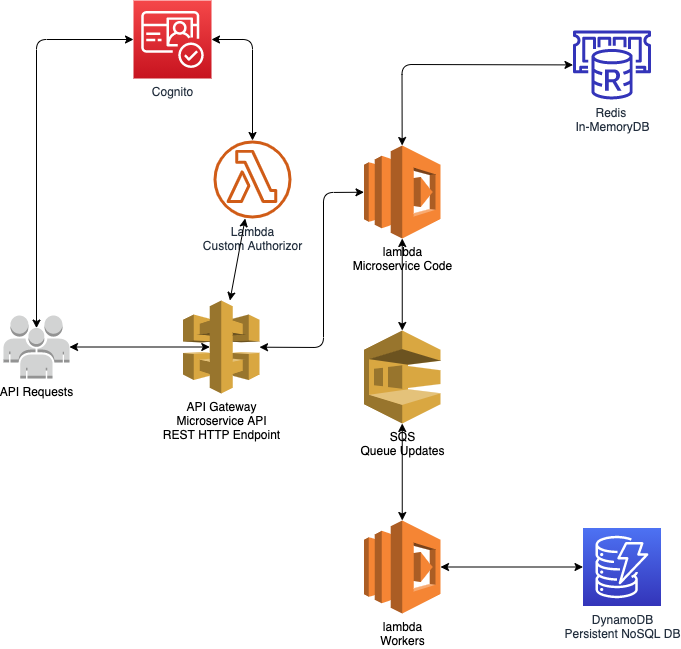

{}
We could potentially build out the API using AWS AppSync - this may also be a quicker method to prototype an initial MVP to get in front of people. For this design however we won't go this route.
{}

- Cognito User Pools are used to store valid users
- Api Gateway uses a lambda as a custom authorizor to authenticate users hitting the API
- Reads of real time data come from the Redis cache
- Requests are queued and workers pick them off as they are available. Example would be checking if a bars queue had open slots and if not pulling spatial index from Dynamo to get a list of nearby bars and calculating which ones to return to the user.

{}
From a performance and cost perspective there are thresholds where lambda may no longer be the best solution. In this scenario we could potentially move our microservice layer to containers and run them on an ECS or EKS cluster.
There is some extra overhead to this as we need to configure and maintain our clusters to ensure we have correct capacity and also need to make sure we have a container hydration strategy in place to keep our container images up to date.
{}
