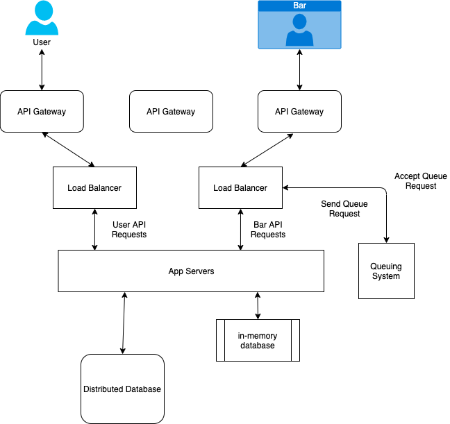

### Setup

At a super high level there are 3 pieces to our system

- A PWA front-end
- A simple backend with an API and some persistent storage
- A Queing System

The Distributed Database can store the User and Bars Profiles (Name, Email, etc). Distributed Databases scale well as we add more users.

The In-Memory Database is used for fast lookups and updates. We can store two things here.

1. States of active Users and Bars.

2. User's Location (for sending ETA to bars)

When a request comes in, it gets assigned to an App Server. We will make our REST API stateless so that any App Server can handle a request. This makes it easy to scale app servers by adding more machines.

#### What happens when a user requests to join a queue

When a user requests to join a queue, the app server sets the User to the REQUESTING state. It then sends a request to the Queing system to make a request to the bar.

The Queing System maintains a pool of available bars (WAITING state). It first sends a queing request to the selected bar. If this is rejected or the queue time is over a specified period, the system keeps sending requests to nearby bars until one accepts or we run out of nearby bars.

If the selected bar accepts the app server matches the user to the bars queue and sets the users status to Queing. This blocks the user from queing at any other nearby bars. It also notifies the bar that the user is in the virtual queue.

If, for whatever reason, the selected bar can't accomodate the user but an alternative is found, the queing system responds to the app server with the bar info. This is sent to the user where they can either confirm they want to join that bars queue or reject it and search again.

At each state change, we inform the User/Bar of the change, so that the mobile UIs can be updated. With the notification, we also send any other info the device might need. For example, when the User is notified that he/she has been changed to the QUEING state, we also calculate the Queing Time and send that with the notification, so that the User's device can display the Queue Time and alert when it's time to physically go to the bar.

{}
We use a similar flow for all our API requests. A Request goes to an App Server, and the App Server processes the request. This involves State Updates to the In Memory DB, Profile Updates to the NoSQL DB, Requests to/from the Queing System and notifying the Users/Bars of State changes.
{}

#### How is the do users know which bars have queue availability as they move around

We need to periodically ping the User's location for all active bars (users not in the QUEUE_FULL state). This can be part of the mobile application. The app can periodically call an HTTP handler with the users's current location. This location is simply written to the In-Memory DB by App Servers. The location is also sent to the Queing System.

The Queing System needs to keep the User's location updated. The Queing System finds bars near a user. It will store each active users's location in a Spatial Index for such queries. Bars locations are stationary.

### Additional Questions

#### How do you know when a user finishes queing and enters the bar

The System can verify the users and bar location is the same for a period longer than the queing time.
