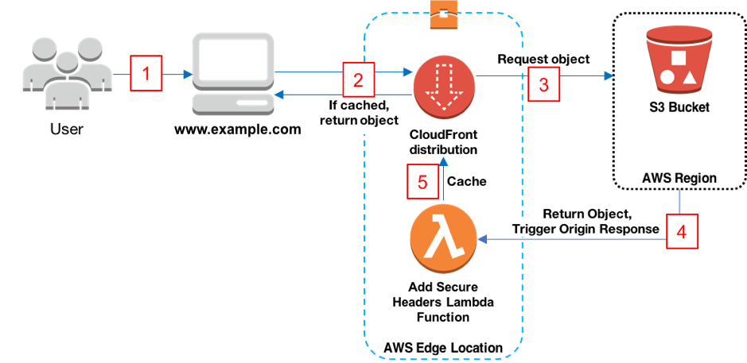

{}
We could potentially build out the PWA using AWS Amplify - this may also be a quicker method to prototype an initial MVP to get in front of people. For this design however we won't go this route.
{}

To start we don't want the overhead of building out Native Applications on IOS and Android so will create a Progressive WebApp which gives us access to some of the device features without the overhead of multiple code bases. To host this we will host the site in S3 and distribute it via Cloudfront. The architecture for this can be seen below

1. The viewer requests the website at www.example.com.
2. If the requested object is cached, CloudFront returns the object from its cache to the viewer.
3. If the object is not in CloudFront’s cache, CloudFront requests the object from the origin (an S3 bucket).
4. S3 returns the object to CloudFront, which triggers the Lambda@Edge origin response event.
5. The object, including the security headers added by the Lambda@Edge function, is added to CloudFront’s cache.
6. (Not shown) The objects is returned to the viewer. Subsequent responses for the object are served from the CloudFront cache.
