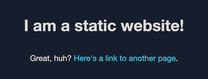

**To deploy the solution using the CloudFormation console**

1. Click the **Launch on AWS** button to open the solution in the CloudFormation console.

   

2. If necessary, sign in with your AWS account credentials.
3. You should see a **Create stack** page, with pre-populated fields that specify the CloudFormation template. Choose the **Next** button at the bottom of the page.
4. On the **Specify stack details** page, enter values for the
   following fields:

   - **SubDomain:** The subdomain for your registered domain name. Viewers use the subdomain to access your website, for example: www.example.com. We recommend using the default value of **www** as the subdomain.
   - **DomainName:** Your registered domain name, such as example.com. This domain must be pointed to a Route 53 hosted zone.

   After entering values, choose the **Next** button.

5. On the **Configure stack options** page, you can optionally [add tags and other stack options](https://docs.aws.amazon.com/AWSCloudFormation/latest/UserGuide/cfn-console-add-tags.html). When finished, choose the **Next** button.
6. On the **Review** page, you must scroll down and check the two boxes in the **Capabilities** section:

   - **I acknowledge that AWS CloudFormation might create IAM resources with custom names.**
   - **I acknowledge that AWS CloudFormation might require the following capability: CAPABILITY_AUTO_EXPAND**

   These capabilities allow CloudFormation to create an IAM role that allows access
   to the stack’s resources, and to name the resources dynamically.

7. Choose the **Create stack** button.
8. Wait for the CloudFormation stack to launch. The stack launches some nested stacks, and can take several minutes to finish. When it’s launched, the **Status** changes to **CREATE_COMPLETE**.
9. After the stack is launched, go to **www.example.com** to view your website (replace **example.com** with your domain name). You should see the website’s default content:

   
